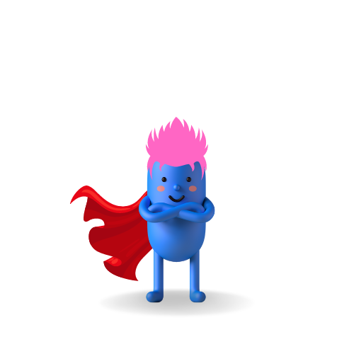

# Livingfood

# An educational website for making living food attractive to kids and grownups
https://livingfood.my.canva.site/

Happy to introduce you to our tiny friends:
# My name is Funky Kraut

# My name is Scoby Doo-cha

# My name is Pizza Hero

We are the living microorganisms (good bacteria and fungi) that transform food during the fermentation process.

Our job is to pre-digest and extract valuable vitamins and enzhymes for your body.
